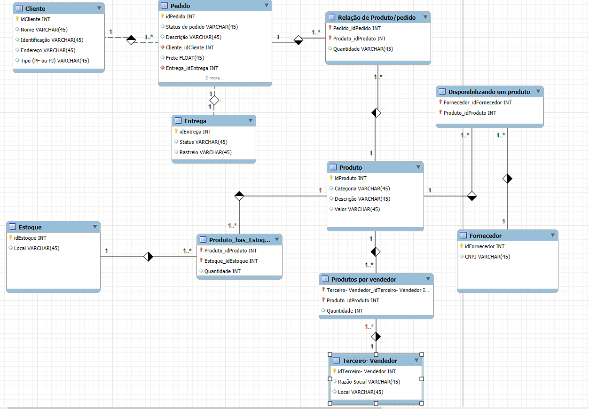

# E-commerce Database Model

Este projeto consiste na modelagem de um banco de dados para um sistema de e-commerce, implementado para gerenciar pedidos, clientes, produtos, estoques, fornecedores e entregas. O objetivo é oferecer uma solução robusta e organizada para lidar com as informações essenciais de um sistema de vendas online.

## 🔧 Estrutura do Banco de Dados

A modelagem é composta pelas seguintes entidades principais:

### 1. **Cliente**
Armazena informações sobre os clientes, permitindo que sejam tanto Pessoa Física (PF) quanto Pessoa Jurídica (PJ).
- **Atributos:**
  - `idCliente`: Identificador único do cliente.
  - `Nome`: Nome do cliente.
  - `Identificação`: CPF ou CNPJ, dependendo do tipo de cliente.
  - `Endereço`: Endereço do cliente.
  - `Tipo`: Indica se o cliente é PF ou PJ.

### 2. **Pedido**
Representa as compras realizadas pelos clientes.
- **Atributos:**
  - `idPedido`: Identificador único do pedido.
  - `Status do pedido`: Estado atual do pedido (ex.: "Em processamento", "Enviado").
  - `Descrição`: Detalhes do pedido.
  - `Frete`: Valor do frete.
  - Chaves estrangeiras:
    - `Cliente_idCliente`: Relaciona o pedido a um cliente.
    - `Entrega_idEntrega`: Relaciona o pedido a uma entrega.

### 3. **Entrega**
Gerencia os envios dos pedidos.
- **Atributos:**
  - `idEntrega`: Identificador único da entrega.
  - `Status`: Estado da entrega (ex.: "A caminho", "Entregue").
  - `Rastreio`: Código de rastreamento da entrega.

### 4. **Produto**
Gerencia os itens disponíveis no e-commerce.
- **Atributos:**
  - `idProduto`: Identificador único do produto.
  - `Categoria`: Categoria à qual o produto pertence.
  - `Descrição`: Detalhes do produto.
  - `Valor`: Preço do produto.

### 5. **Estoque**
Controla os locais de armazenamento dos produtos.
- **Atributos:**
  - `idEstoque`: Identificador único do estoque.
  - `Local`: Localização do estoque.

### 6. **Produto_has_Estoque**
Relaciona produtos aos estoques e suas quantidades.
- **Atributos:**
  - `Produto_idProduto`: Relaciona com a tabela Produto.
  - `Estoque_idEstoque`: Relaciona com a tabela Estoque.
  - `Quantidade`: Quantidade do produto disponível no estoque.

### 7. **Fornecedor**
Gerencia os fornecedores dos produtos.
- **Atributos:**
  - `idFornecedor`: Identificador único do fornecedor.
  - `CNPJ`: Cadastro Nacional de Pessoa Jurídica do fornecedor.

### 8. **Disponibilizando um Produto**
Relaciona fornecedores aos produtos que eles oferecem.
- **Atributos:**
  - `Fornecedor_idFornecedor`: Relaciona com a tabela Fornecedor.
  - `Produto_idProduto`: Relaciona com a tabela Produto.

### 9. **Terceiro-Vendedor**
Representa vendedores terceiros que podem ofertar produtos no e-commerce.
- **Atributos:**
  - `idTerceiro`: Identificador único do vendedor.
  - `Razão Social`: Nome jurídico do vendedor.
  - `Local`: Localização do vendedor.

### 10. **Produtos por Vendedor**
Relaciona vendedores terceiros aos produtos que eles disponibilizam.
- **Atributos:**
  - `Terceiro_Vendedor_idTerceiro`: Relaciona com a tabela Terceiro-Vendedor.
  - `Produto_idProduto`: Relaciona com a tabela Produto.
  - `Quantidade`: Quantidade de produtos disponíveis pelo vendedor.

---

## 🛠️ Funcionalidades do Sistema

1. **Gerenciamento de Clientes:** Suporte a PF e PJ com validação de dados específicos (CPF ou CNPJ).
2. **Gestão de Pedidos:** Relacionamento direto entre clientes, pedidos e entregas.
3. **Controle de Estoque:** Rastreamento de quantidades de produtos em diferentes locais de armazenamento.
4. **Integração com Fornecedores e Terceiros:** Permite incluir produtos de fornecedores e vendedores externos no catálogo do e-commerce.
5. **Gestão de Entregas:** Suporte a rastreamento e status atualizado dos envios.

---

## 📚 Pré-requisitos

1. **Sistema Gerenciador de Banco de Dados (SGBD):** MySQL, MariaDB ou outro SGBD compatível com SQL.
2. **Ferramenta de Modelagem:** Diagrama criado com ferramentas como MySQL Workbench.

---

## 🚀 Configuração do Banco de Dados

1. Execute o script SQL correspondente à modelagem.
2. Certifique-se de criar as chaves estrangeiras e as restrições conforme o diagrama apresentado.
3. Popule as tabelas com dados iniciais para teste e validação do sistema.

---

## 📋 Observações

- A modelagem é flexível e pode ser adaptada conforme as necessidades específicas do e-commerce.
- Campos opcionais (como CPF ou CNPJ) devem ser validados na aplicação para garantir consistência nos dados.

---

## 🖼️ Diagrama do Banco de Dados

---

## 📬 Contato

Caso tenha dúvidas ou sugestões sobre este projeto, entre em contato:

- **Email:** [seu-email@exemplo.com](mailto:andreicardozo300@gmail.com)
- **GitHub:** [seu-usuario](https://github.com/AndreiCardozo)
